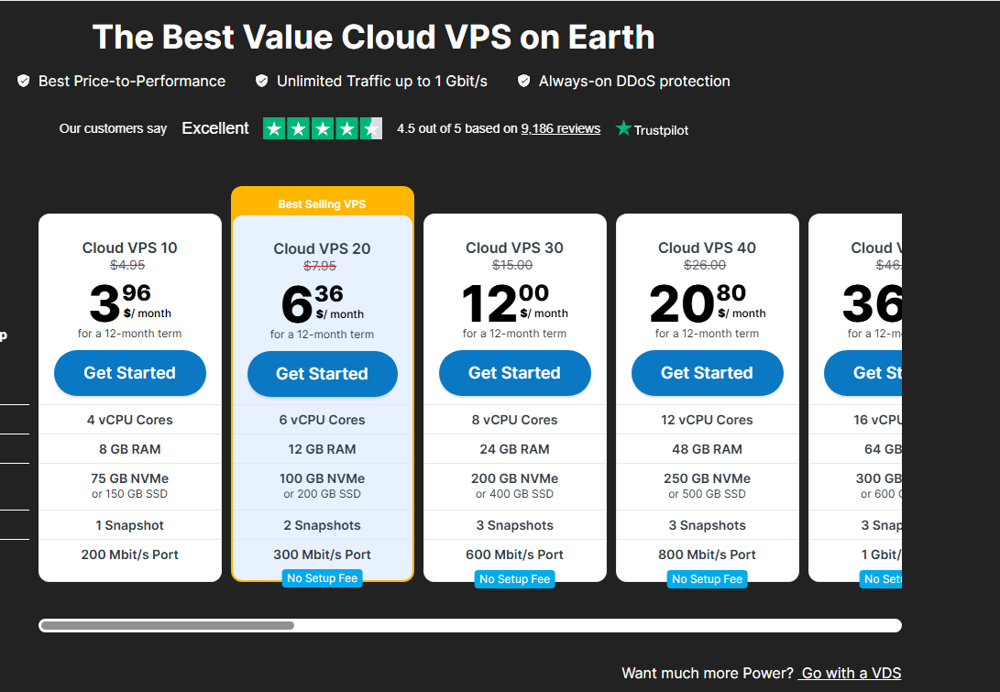
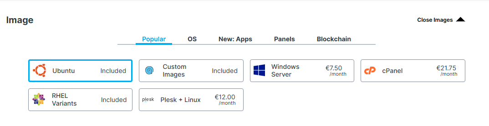
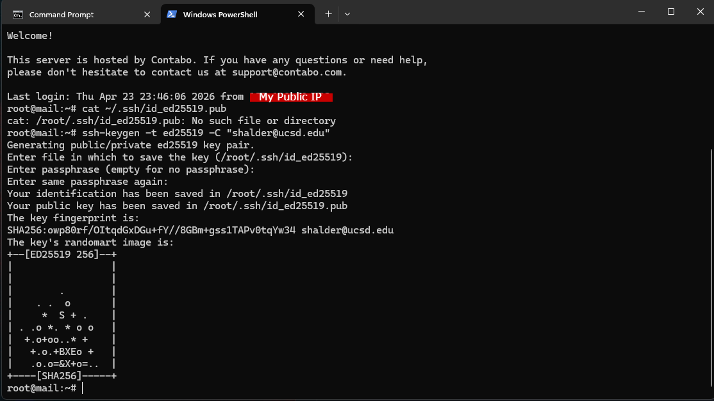

# VPS Getting Started: Contabo + SSL


> **Screenshots:** Create an `images/vps/` folder and save screenshots using the filenames referenced below.

---

## Table of Contents

1. [What is a VPS](#what-is-a-vps)
2. [Contabo Plans](#contabo-plans)
3. [Create Your Server](#create-your-server)
4. [Connect to Your Server](#connect-to-your-server)
5. [Initial Server Setup](#initial-server-setup)
6. [Install a Web Server](#install-a-web-server)
7. [Point Your Domain to the VPS](#point-your-domain-to-the-vps)
8. [Install SSL with Let's Encrypt](#install-ssl-with-lets-encrypt)
9. [Test Everything](#test-everything)

---

## What is a VPS

A **Virtual Private Server (VPS)** is a rented Linux server in the cloud. You get full root access — you control what's installed, what runs, and how it's configured. Unlike shared hosting, nothing else on the machine affects your site.

**Common uses:** websites, APIs, game servers, bots, databases, self-hosted apps.

---

## Contabo Plans

Contabo gives you far more specs per dollar than most providers.

| Plan | vCPU | RAM | Storage | Price |
|------|------|-----|---------|-------|
| **VPS S** | 4 vCPU | 8 GB | 100 GB NVMe | ~$7/mo |
| **VPS M** | 6 vCPU | 16 GB | 200 GB NVMe | ~$14/mo |
| **VPS L** | 8 vCPU | 30 GB | 400 GB NVMe | ~$27/mo |

> **VPS S** is plenty for a personal site, small app, or game server. Most providers charge $40+/mo for the same specs.

> **Note:** Contabo charges a one-time **setup fee** (~$5) on your first order. This is normal.

---

## Create Your Server

1. Go to **contabo.com** and click **VPS** in the navigation
2. Choose a plan — **VPS S** is enough to start

   

3. Choose a **region** — pick the one closest to your users (US, EU, Asia, etc.)
4. Under **OS Image**, select **Ubuntu 24.04**

   

5. Under **SSH Keys**, add your public key — this is safer than using a password

   Generate an SSH key if you don't have one:
   ```bash
   ssh-keygen -t ed25519 -C "your@email.com"
   ```

   Copy your public key:
   ```bash
   # Windows
   cat ~/.ssh/id_ed25519.pub | clip

   # macOS
   cat ~/.ssh/id_ed25519.pub | pbcopy

   # Linux
   cat ~/.ssh/id_ed25519.pub
   ```

   Paste it into the SSH key field on the order page.

   

6. Complete checkout
7. **Wait for the confirmation email** — Contabo can take a few hours to provision. The email will include your **server IP address** and root credentials.

---

## Connect to Your Server

Once you receive the confirmation email, connect using your IP address:

```bash
ssh root@YOUR_SERVER_IP
```

Example:
```bash
ssh root@203.0.113.10
```

Type `yes` when asked to confirm the fingerprint. You're now inside your server.

---

## Initial Server Setup

Run these commands right after your first login.

### 1 — Update the system
```bash
apt update && apt upgrade -y
```

### 2 — Create a non-root user
```bash
adduser yourname
usermod -aG sudo yourname
```

### 3 — Copy SSH key to the new user
```bash
rsync --archive --chown=yourname:yourname ~/.ssh /home/yourname
```

### 4 — Test the new user (open a separate terminal)
```bash
ssh yourname@YOUR_SERVER_IP
```

### 5 — Set up a basic firewall
```bash
ufw allow OpenSSH
ufw allow 80
ufw allow 443
ufw enable
```

Confirm with `y` when prompted.

> From this point, log in as your new user instead of root.

---

## Install a Web Server

### Option A — Nginx (recommended)

```bash
sudo apt install nginx -y
sudo systemctl enable nginx
sudo systemctl start nginx
```

Visit `http://YOUR_SERVER_IP` in a browser — you should see the Nginx welcome page.

### Option B — Apache

```bash
sudo apt install apache2 -y
sudo systemctl enable apache2
sudo systemctl start apache2
```

---

### Create a Basic Site (Nginx)

```bash
sudo mkdir -p /var/www/example.com
sudo chown -R $USER:$USER /var/www/example.com
```

Create a test page:
```bash
nano /var/www/example.com/index.html
```

Paste this in:
```html
<!DOCTYPE html>
<html>
  <head><title>My Site</title></head>
  <body><h1>It works!</h1></body>
</html>
```

Save with `Ctrl+O`, `Enter`, then `Ctrl+X`.

Create an Nginx config for your domain:
```bash
sudo nano /etc/nginx/sites-available/example.com
```

Paste this (replace `example.com` with your actual domain):
```nginx
server {
    listen 80;
    server_name example.com www.example.com;
    root /var/www/example.com;
    index index.html;

    location / {
        try_files $uri $uri/ =404;
    }
}
```

Enable it and reload:
```bash
sudo ln -s /etc/nginx/sites-available/example.com /etc/nginx/sites-enabled/
sudo nginx -t
sudo systemctl reload nginx
```

---

## Point Your Domain to the VPS

Go to wherever your domain's DNS is managed (your registrar, or any DNS provider) and add these records:

```
Type:  A      Name: @    Content: YOUR_SERVER_IP
Type:  CNAME  Name: www  Content: example.com
```

Wait a few minutes for DNS to propagate, then verify:
```bash
nslookup example.com 8.8.8.8
```

---

## Install SSL with Let's Encrypt

Let's Encrypt gives you a free, trusted SSL certificate. Certbot handles everything automatically.

### Install Certbot

```bash
sudo apt install certbot python3-certbot-nginx -y
```

### Get Your Certificate

```bash
sudo certbot --nginx -d example.com -d www.example.com
```

Certbot will:
- Verify you own the domain
- Issue the certificate
- Automatically update your Nginx config for HTTPS

When prompted:
- Enter your email address
- Agree to the terms
- Choose whether to share your email with EFF (optional)

If successful you'll see:
```
Congratulations! Your certificate and chain have been saved at:
/etc/letsencrypt/live/example.com/fullchain.pem
```

### Auto-Renewal

Certbot sets up auto-renewal automatically. Test it with:
```bash
sudo certbot renew --dry-run
```

---

## Test Everything

- [ ] `http://example.com` redirects to `https://example.com`
- [ ] `https://example.com` loads with a valid padlock in the browser
- [ ] `https://www.example.com` also works
- [ ] No errors in browser DevTools (F12 → Console)

### Useful checks
```bash
# Check cert status
sudo certbot certificates

# Check Nginx is running
sudo systemctl status nginx

# Check firewall rules
sudo ufw status
```

---

## Quick Command Reference

```bash
# Reload Nginx after config changes
sudo systemctl reload nginx

# Test Nginx config for syntax errors
sudo nginx -t

# Renew SSL certificate manually
sudo certbot renew

# View Nginx error logs
sudo tail -f /var/log/nginx/error.log

# View Nginx access logs
sudo tail -f /var/log/nginx/access.log
```

---

## What's Next

- **Deploy an app** — Node.js, Python, PHP behind Nginx as a reverse proxy
- **Set up a database** — MySQL or PostgreSQL
- **Add email** — Use a mail service (Mailgun, Resend, Google Workspace) instead of hosting your own
- **Harden your server** — Disable root SSH login, set up fail2ban

---

*Last updated: April 2026*
